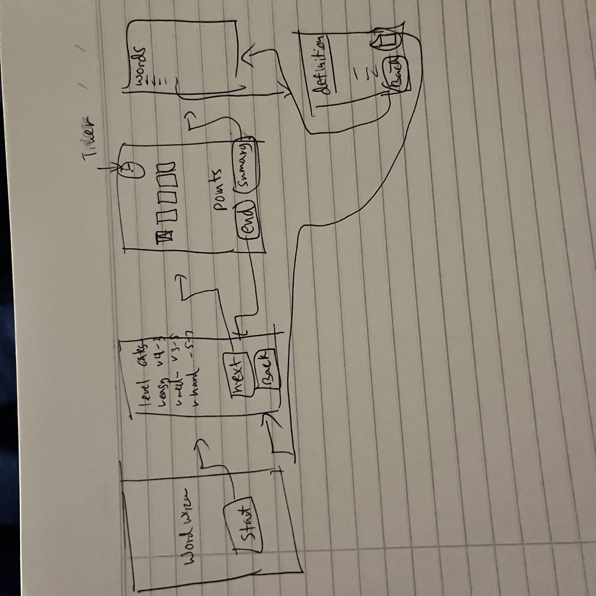

WordWhiz 🔠
===

## Table of Contents

1. [Overview](#Overview)
2. [Product Spec](#Product-Spec)
3. [Wireframes](#Wireframes)
4. [Schema](#Schema)

## Overview

### Description
WordWhiz: "Chain of Words" is a fast-paced word game where the computer gives you a letter, and you have to quickly create a word starting with that letter. Then, the computer responds with a word starting with the last letter of your word. Keep the chain going to earn points and unlock levels. Think fast and stay sharp in this addictive word challenge!

### App Evaluation

- **Category:** Word Game
- **Mobile:** Designed for iOS devices
- **Story:** Engaging word-linking gameplay
- **Market:** Targets iOS users of all ages
- **Habit:** Encourages regular play and skill improvement
- **Scope:** Comprehensive word gaming experience

## Product Spec

### 1. User Stories (Required and Optional)

**Required Must-have Stories**

* As a player, I want to receive a randomly generated letter to start the game.
* As a player, I want to create a word starting with the given letter.
* As a player, I want the computer to generate a word starting with the last letter of my word.
* As a player, I want to submit my word within a given time frame.
 

**Optional Nice-to-have Stories**

* As a player, I want to compete with friends or other players online.
* As a player, I want to customize the time frame for submitting words.
* As a player, I want to receive hints or suggestions when I'm stuck.
* As a player, I want to access a dictionary feature for word definitions.

### 2. Screen Archetypes

- [X] Home Screen
  * Display a randomly generated letter
  * Allow the player to input a word starting with the given letter
  * Validate the word and display the computer-generated word
  * Include a timer for submitting the word within a time frame

- [ ] Leaderboard Screen
  * Display the leaderboard with scores of players
  * Show the progress and achievements of the player
  * Provide options to view different leaderboards (e.g., daily, weekly, all-time)

- [ ] Settings Screen
  * Allow customization of game settings such as time frame for submitting words
  * Provide options to toggle sound effects and notifications
  * Allow access to account settings and profile customization

- [ ] Dictionary Screen
  * Allow players to look up word definitions
  * Provide search functionality to find specific words
  * Display related words or synonyms for selected words

- [ ] Levels Screen
  * Display different levels of difficulty
  * Provide information about each level, such as word length or time constraints
  * Allow players to select and start a level of their choice

**Tab Navigation** (Tab to Screen)

* Home Screen
* Leaderboard Screen
* Settings Screen
* Dictionary Screen
* Levels Screen

**Flow Navigation** (Screen to Screen)

- [X] Home Screen
  * Navigate to Leaderboard Screen when viewing leaderboard
  * Navigate to Settings Screen to adjust game settings
  * Navigate to Dictionary Screen to look up word definitions
  * Navigate to Levels Screen to select a game level

- [ ] Leaderboard Screen
  * Navigate to Home Screen to return to the main game interface
  * Navigate to Settings Screen to adjust game settings
  * Navigate to Dictionary Screen to look up word definitions
  * Navigate to Levels Screen to select a game level

- [ ] Settings Screen
  * Navigate to Home Screen to return to the main game interface
  * Navigate to Leaderboard Screen to view leaderboard
  * Navigate to Dictionary Screen to look up word definitions
  * Navigate to Levels Screen to select a game level

- [ ] Dictionary Screen
  * Navigate to Home Screen to return to the main game interface
  * Navigate to Leaderboard Screen to view leaderboard
  * Navigate to Settings Screen to adjust game settings
  * Navigate to Levels Screen to select a game level

- [ ] Levels Screen
  * Navigate to Home Screen to return to the main game interface
  * Navigate to Leaderboard Screen to view leaderboard
  * Navigate to Settings Screen to adjust game settings
  * Navigate to Dictionary Screen to look up word definitions

## Wireframes

## Demo

<iframe src="https://www.loom.com/embed/cb5e70e05fda4c74a66e887f0a474b7f?sid=7b0d93d7-e75e-4c9e-9888-fb6bf53e1edd" frameborder="0" webkitallowfullscreen mozallowfullscreen allowfullscreen style="position: absolute; top: 0; left: 0; width: 100%; height: 100%;"></iframe>

### [BONUS] Digital Wireframes & Mockups

### [BONUS] Interactive Prototype

## Schema 

[This section will be completed in Unit 9]

### Models

[Add table of models]

### Networking

- [Add list of network requests by screen ]
- [Create basic snippets for each Parse network request]
- [OPTIONAL: List endpoints if using existing API such as Yelp]
